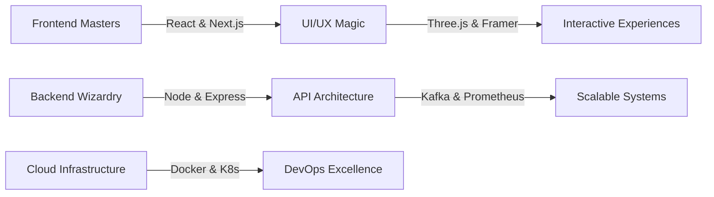

# 🌌 *Welcome to Vipul Shetty's Digital Universe!* 🌌

  

---

## 🎭 *About Me*
> "Code is poetry, innovation is art, and technology is the canvas."

- 🌍 Based in *Bengaluru, India*
- 🎓 Engineering Graduate specializing in *Computer Science*
- 💼 * Former-Full Stack Developer* at Algorizz
- 🤖 *AI Explorer* | ☁️ *Cloud Innovator* | 💡 *Problem Solver*
- 🔗 [*Portfolio*](https://portfolio-vipul.vercel.app/) | [*LinkedIn*](https://www.linkedin.com/in/vipul-shetty-49a1a9251/)

---

## 🏆 *Badges & Achievements*

  <!-- Postman Badge -->
  
  
  <!-- GitHub Achievements -->
  
  

  <!-- Problem Solver Badges -->
  
  

  
  
  
  

## 🔧 *Tech Stack*

  

### *Development Symphony* 🎼

## 🚀 *Highlighted Projects*

### 🌍 [*EcoEarn*](https://portfolio-vipul.vercel.app/)

  
  
  

### 🤝 [*CollabAI*](https://collabai-frontend.vercel.app/)

  
  
  

## 📈 *GitHub Activity*

  

  
  

  

## 🌐 *Let's Connect!*

  
  
  
  

---

  

